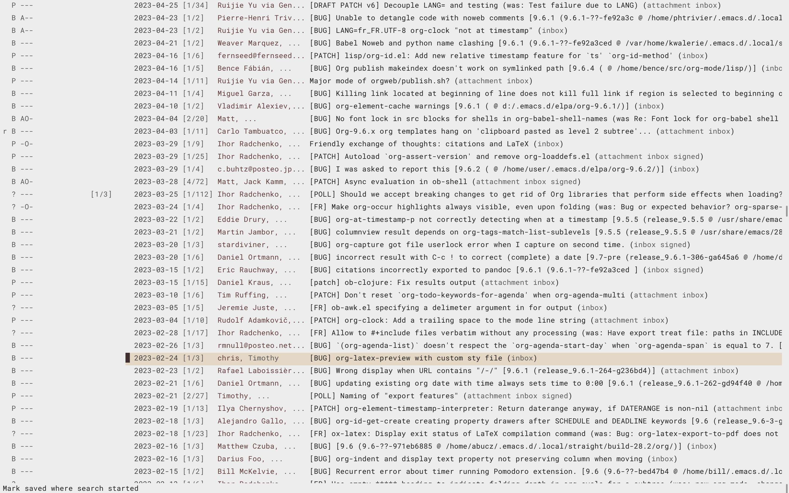

#+title: notmuch-gnaw.el --- Highlight BONE reports in notmuch

[[https://intver.org/][https://img.shields.io/badge/versioning-intver.org-blue.svg?style=for-the-badge]]

*This library is not actively maintained, it is shared as a proof of
concept.  If you want to maintain and develop it, please [[mailto:bzg@bzg.fr][contact me]].*

=notmuch-gnaw= highlights notmuch emails whose =Message-Id= matches an
open [[https://codeberg.org/bzg/bone][BONE]] report. It reads the same =reports.json= sources as [[https://codeberg.org/bzg/gnaw][gnaw]].

* Requirements

- The [[https://codeberg.org/bzg/gnaw.el][gnaw.el]] library, which provides the shared data layer
  (configuration, report cache and =state.edn= handling).  Once
  =notmuch-gnaw= is on MELPA this dependency will be pulled in
  automatically; until then, see /Installation/ below.
- =~/.config/gnaw/config.edn= (shared with gnaw), containing at least
  a =:sources= vector with =:url= entries pointing to =reports.json=
  files (local paths or URLs).
- =notmuch-gnaw= supports =reports.json= bone-format =0.9.1=.
- =notmuch-gnaw= does not call the =gnaw= binary, it only reads the
  files that =gnaw= produces.  You need to have run =gnaw= at least
  once to generate =config.edn= and the =reports.json= files.

* Installation

=notmuch-gnaw= is not on MELPA yet.  On Emacs 30 or later, install it
from git with the built-in =package-vc=.  Install [[https://codeberg.org/bzg/gnaw.el][gnaw.el]] *first*,
since it is its dependency and is not in any package archive (the
=notmuch= dependency is pulled from NonGNU ELPA automatically):

#+begin_src emacs-lisp
(use-package gnaw
  :vc (:url "https://codeberg.org/bzg/gnaw.el" :rev :newest))

(use-package notmuch-gnaw
  :vc (:url "https://codeberg.org/bzg/notmuch-gnaw" :rev :newest))
#+end_src

Or interactively, in order:

: M-x package-vc-install RET https://codeberg.org/bzg/gnaw.el RET
: M-x package-vc-install RET https://codeberg.org/bzg/notmuch-gnaw RET

Update later with =M-x package-vc-upgrade=.

* Commands

- =M-x notmuch-gnaw= — Search for open BONE reports and highlight them.
- =M-x notmuch-gnaw-tree= — Show open BONE reports in =notmuch-tree=.
- =M-x notmuch-gnaw-highlight= — Highlight matches in current
  =notmuch-search= buffer.
- =M-x notmuch-gnaw-topic= — Filter reports by selected topic.
- =M-x notmuch-gnaw-clear= — Remove all =notmuch-gnaw= overlays.

** Local marks

The following commands toggle gnaw's local marks. They edit
=~/.config/gnaw/state.edn=, which is shared with the =gnaw= CLI and
=gnus-gnaw=, so marks are visible across all three.

- =M-x notmuch-gnaw-mark-read= — Toggle the =:read-at= timestamp.
- =M-x notmuch-gnaw-mark-todo= — Toggle the =:todo= flag.
- =M-x notmuch-gnaw-mark-sticky= — Toggle the =:sticky= flag.

The annotation gains a leading column showing the current mark:
=!= for =:todo=, =*= for =:sticky=, =r= for =:read-at= (without flag).

In =notmuch-search-mode= a line is a thread; the *first* message-id in
that thread that is also a BONE report is the one toggled.  Use
=M-x notmuch-gnaw-tree= to mark a specific report when a thread contains
several.

* Contributing

- Send a [[mailto:~bzg/boneyard@lists.sr.ht][bug report]] with =[BUG] notmuch-gnaw: <SHORT EXPLICIT BUG DESCRIPTION>=
- Send a [[mailto:~bzg/boneyard@lists.sr.ht][patch]] with =[PATCH] notmuch-gnaw: <COMMIT SUMMARY>=
- Send a [[mailto:~bzg/boneyard@lists.sr.ht][feature request]] with =[FR] notmuch-gnaw: <FEATURE REQUEST>=
- Share any [[mailto:~bzg/boneyard@lists.sr.ht <ANYTHING>][other question or idea]]

You can also [[mailto:bzg@bzg.fr][send me an email]] and support my work on [[https://liberapay.com/bzg/][liberapay]].

* Intentional Versioning

This project uses [[https://intver.org][Intentional Versioning]], with three audiences:

- =x=: end users
- =y=: packagers
- =z=: contributors to the codebase

* License

Copyright © 2026 Bastien Guerry

=notmuch-gnaw.el= is published under the terms of the GNU General Public
License as the Free Software Foundation, either version 3 of the
License, or (at your option) any later version.

